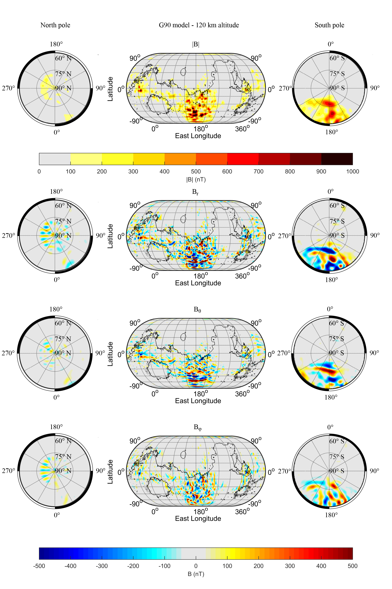

  
  
  
  
  # Mars G110 model
  
  ## This model has been reviewed and g_110_mm_q.mat is used as coefficients now.
  
  ## This model has been changed to 110 degree
  

  Martian crustal field model_G110:
  A spherical harmonic curstal field model describing the Martian crustal field
  
  
  # Description
 
  This crustal field model is a spherical harmonic model using spherical harmonic function up to degree 110. This model is establised by combinning MAVEN and MGS magnetic field obseration data. We use the conventional least squares measure to determine the Gauss coefficients, while no regularization was applied. The magnetic quiet and noise data are separated by using a magnetic field activity proxy. The resulting model delineates the details of the crustal field with a spatial resolution of ∼200 km at 120 km altitude. At satellite altitudes, this model shows a lower misfit than any other presented model, which indicates that this model is more reliable to represent the crustal field. This model determined the Martian global crustal field power spectrum robustly, and we found that small-scale fields are much larger than precious estimation. For the first time, the morphology of the crustal field is well determined, which will help to study the crustal field at ionosphere altitude.
 
  # Coordinates
  
  If you want to calculate the crustal field in Mars planetocentric (PC) spherical coordinate. Please use the function gao_r.m. Input pc_xyz should be in unit of km. Output bpcsph would be in unit of nT.
  If you want to calculate the crustal field in Mars planetocentric (PC) cartesian coordinate. Please use the function gao.m. Input pc_xyz should be in unit of km. Output bpc_xyz would be in unit of nT.
   
  # Requirements
  
  This code is compatible with Windows and Mac operating systems, with matlab installed. For parallel computing, a paralled pool is needed. If you do not want to use paralled computing, please change the code 'parfor' to 'for' in both gao.m and gao_r.m. Note that paralled computing will significantly reduce the computation time.
  
  # Results
  
  Just run the example_1.m in Matlab, you will get a crustal field map of crustal field Bx component at martian surface. You can change the ploting altitude by changing 'r' in the code. The spherical harmonic coefficients are provied in g_90_mm_jial.mat and h_90_mm_jial.mat.
  
  # License
  This code is covered under the MIT License.
